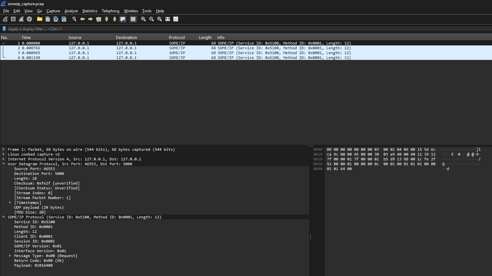

## Why this project exists

Modern automotive ECUs communicate over Ethernet using service-oriented
protocols (SOME/IP) and diagnostic protocols (UDS over DoIP). Production
code uses heavy middleware (vsomeip, ara::com) that abstracts away the
wire format. While that's right for production, it's wrong for learning —
engineers who only know the middleware can't debug issues in a Wireshark
capture or read a SOME/IP specification fluently.

This project goes the other way: implement the protocols by hand at the
byte level, then verify against the standard using Wireshark's dissector.

---

## Demo

### SOME/IP REQUEST construction (client)

The client builds a 20-byte SOME/IP message — 16-byte header + 4-byte
payload — and sends it via UDP to the server.
Sending 20 bytes: 51 00 00 01 00 00 00 0C 00 01 00 01 01 01 00 00 01 01 64 00

### SOME/IP header parsing (server)

The server receives the bytes and parses every header field manually
using shift-and-OR big-endian deserialization.
Received 20 bytes from 127.0.0.1:46889
Service ID:        0x5100
Method ID:         0x0001
Length:            12
Client ID:         0x0001
Session ID:        0x0001
Protocol Version:  0x01
Interface Version: 0x01
Message Type:      0x00 (REQUEST)
Return Code:       0x00 (E_OK)
Payload (4 bytes): 01 01 64 00

### Wireshark verification

The same packet, dissected by Wireshark's built-in SOME/IP dissector,
shows identical field values — independent confirmation that the
implementation matches the AUTOSAR PRS specification.



---

## Repository structure
automotive-ethernet-fundamentals/
├── README.md                       (this file)
└── someip/                         SOME/IP client and server
├── README.md
├── someip_client.cpp           Constructs SOME/IP REQUEST manually
├── someip_server.cpp           Parses SOME/IP header field by field
├── someip_capture.pcap         Wireshark capture of a request
└── wireshark_someip_dissected.png

---

## SOME/IP wire format implemented

The 16-byte SOME/IP header, all fields big-endian:

| Offset | Size | Field             | Example value |
|-------:|-----:|:------------------|:--------------|
| 0      | 2 B  | Service ID        | 0x5100        |
| 2      | 2 B  | Method ID         | 0x0001        |
| 4      | 4 B  | Length            | 0x0000000C    |
| 8      | 2 B  | Client ID         | 0x0001        |
| 10     | 2 B  | Session ID        | 0x0001        |
| 12     | 1 B  | Protocol Version  | 0x01          |
| 13     | 1 B  | Interface Version | 0x01          |
| 14     | 1 B  | Message Type      | 0x00 (REQ)    |
| 15     | 1 B  | Return Code       | 0x00 (E_OK)   |

**Length field semantic:** describes the number of bytes *after* the Length
field itself — 8 bytes of the second-half header (Client ID through
Return Code) plus the payload. A message with a 4-byte payload has
Length = 12.

---

## Build and run

Requires: Linux (or WSL2 with Ubuntu), g++ with C++17 support.

```bash
cd someip
g++ -std=c++17 -Wall -Wextra -o someip_server someip_server.cpp
g++ -std=c++17 -Wall -Wextra -o someip_client someip_client.cpp
```

Terminal 1 — start the server:
```bash
./someip_server
```

Terminal 2 — run the client:
```bash
./someip_client
```

---

## What I learned

- **POSIX socket API** — `socket()`, `bind()`, `sendto()`, `recvfrom()`,
  `inet_pton()`, `inet_ntop()`, `close()`.
- **Network byte order** — manual big-endian serialization with
  shift-and-mask, and deserialization with shift-and-OR.
- **C++17 fundamentals** — `constexpr`, `static_cast`, fixed-width integer
  types (`uint8_t`, `uint16_t`, `uint32_t`), pointers, arrays,
  function decomposition.
- **Defensive programming** — error checks on every system call,
  `errno`/`strerror`, exit-code conventions.
- **SOME/IP wire format** — every field, big-endian convention,
  Length field semantics.
- **Linux tooling** — `tcpdump` packet capture, `.pcap` files,
  Wireshark dissection, vim editing.
- **Git workflow** — meaningful commit messages, layered commits per
  feature, `.gitignore`.

---

## Scope and limitations

This is a learning project. It demonstrates protocol fundamentals at the
wire level, not production-grade automotive software.

**What's implemented:**
- SOME/IP REQUEST construction with full 16-byte header (client)
- SOME/IP header parsing field-by-field (server)
- Wireshark capture and dissection for independent verification

**What's deliberately NOT implemented (yet):**
- SOME/IP RESPONSE (message type 0x80) — server currently echoes raw bytes
- SOME/IP Service Discovery (SD) — no `OfferService`, `FindService`,
  `SubscribeEventgroup` exchange
- Event/notification messages — only method calls
- UDS / ISO 14229 diagnostic services
- DoIP / ISO 13400 transport for diagnostics
- ara::com / vsomeip middleware integration
- AUTOSAR Adaptive ARXML service description
- Security (TLS, MACsec, UDS Security Access)
- TCP transport for large SOME/IP messages
- Multiple concurrent clients or session management

A production AUTOSAR Adaptive node would use ara::com on top of a tested
SOME/IP middleware stack (vsomeip). This project shows what's underneath
that abstraction.

---

## References

- AUTOSAR PRS — SOME/IP Protocol Specification (foundation release)
- ISO 14229-1 — Unified Diagnostic Services (UDS)
- ISO 13400-2 — Diagnostic communication over IP (DoIP)
- RFC 768 — User Datagram Protocol
- Wireshark SOME/IP dissector documentation
