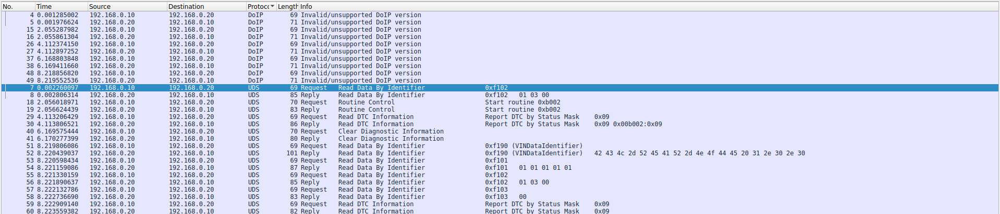
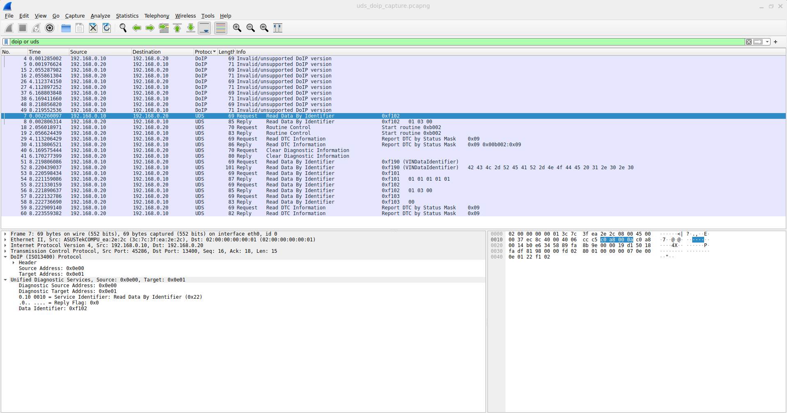
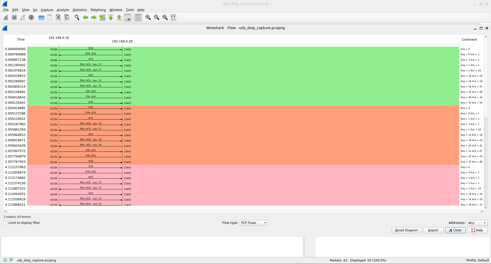
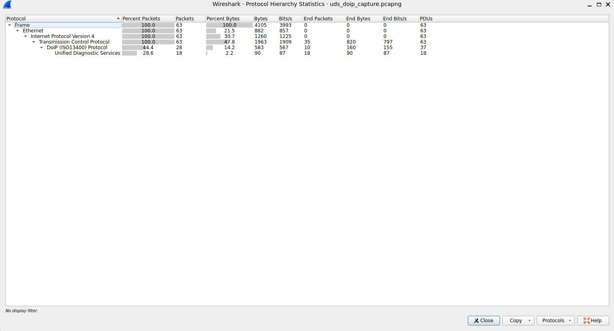
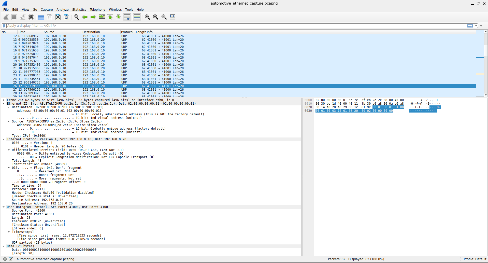
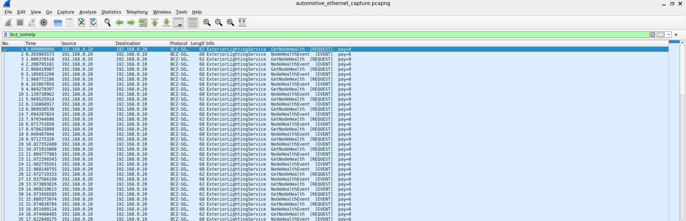
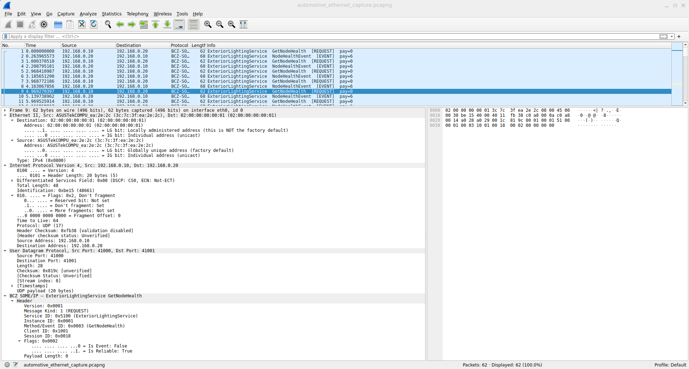
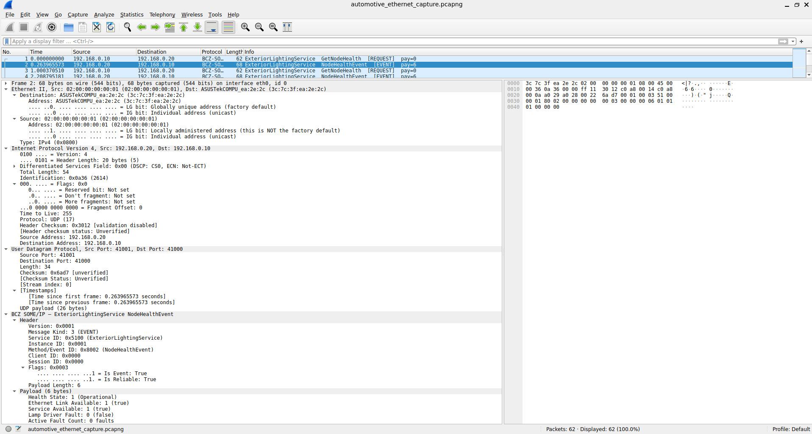
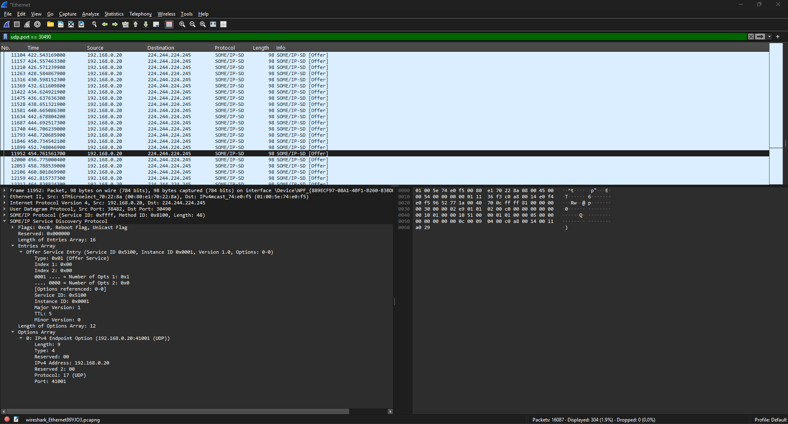

# Wireshark Captures — Automotive Ethernet

This folder contains real packet captures from the running Body Control
Zonal Lighting system showing SOME/IP-shaped UDP traffic and UDS over DoIP
between the Linux controller (192.168.0.10) and the STM32 NUCLEO-H753ZI
exterior lighting node (192.168.0.20).

## Screenshots

### Packet list — DoIP and UDS frames recognized



Wireshark's protocol dissectors automatically identify DoIP (ISO 13400-2) and
UDS (ISO 14229-1) frames in the captured traffic. No custom configuration
required — the framing matches the standards exactly.

### UDS request fully decoded



A single UDS request frame expanded through every protocol layer:
Ethernet → IP → TCP → DoIP → UDS. Service ID 0x22 (ReadDataByIdentifier) and
Data Identifier 0xF102 (NodeHealthStatus) are visible at the UDS layer.

### TCP flow graph



Complete TCP exchange visualized: handshake (SYN, SYN+ACK, ACK), DoIP routing
activation, UDS request and response, TCP close (FIN). One full diagnostic
operation in a single picture.

### Protocol hierarchy



Statistics view confirming the full automotive protocol stack is present in
the capture and identifying the share of UDS-bearing frames within the overall
TCP traffic.

### SOME/IP-shaped UDP payload



Frame from the second capture file showing the periodic event traffic on UDP
ports 41000/41001. Wireshark does not auto-decode our custom SOME/IP framing,
so the payload is shown as raw bytes — the codec is documented in
`include/body_control/lighting/transport/lighting_payload_codec.hpp`.

## Decoded with custom Lua dissector

The five screenshots above show captures using only
Wireshark's built-in DoIP and UDS dissectors. The custom
SOME/IP-shaped UDP payload was raw bytes. After loading
the dissector at doc/captures/wireshark_dissector/bcz_someip.lua,
the same frames decode into named fields.

### Packet list with decoded protocol



The Protocol column now shows BCZ SOME/IP and the Info
column resolves service and method names. No more
guessing what is in the UDP payload — every frame is
identified by its automotive purpose.

### Request frame decoded



Every header byte parsed and named. Service ID 0x5100
shown as ExteriorLightingService, method ID 0x0003 as
GetNodeHealth. Client and session IDs shown as standard
SOME/IP fields. Message type and return code resolved
to enum names.

### Event payload decoded



The 6-byte NodeHealthStatus payload parsed into its
five fields: HealthState, EthernetLinkAvailable,
ServiceAvailable, LampDriverFaultPresent,
ActiveFaultCount. Each field shown by name with its
runtime value.

## Capture 1 — automotive_ethernet_capture.pcapng

Controller-to-rear-node periodic communication on ports 41000/41001 over
physical Ethernet. Captured on eth0 with the STM32 board running.

Frame structure observed:

- **Controller → STM32** (port 41000 → 41001), 20-byte payload:
  SOME/IP-shaped GetNodeHealth request (service 0x5100, method 0x0003)
- **STM32 → Controller** (port 41001 → 41000), 26-byte payload:
  NodeHealthStatusEvent response

This proves the SOME/IP-shaped UDP transport is working between the Linux
host and the embedded target over real Ethernet, not just simulated locally.

## Capture 2 — uds_doip_capture.pcapng

UDS diagnostic exchange over DoIP (ISO 13400-2) on TCP port 13400. Captured
while running the Python UDS client against the STM32 board.

Sequence per UDS call:

1. TCP three-way handshake (SYN, SYN+ACK, ACK)
2. DoIP routing activation request and response
3. UDS request — e.g. 0x22 ReadDataByIdentifier for DID 0xF102 (NodeHealthStatus)
4. UDS positive response with payload
5. TCP FIN exchange to close connection

Wireshark's DoIP dissector flags the version byte as "Invalid/unsupported"
because our implementation uses DoIP version 0x01 (the original
ISO 13400-2:2012 revision) while the dissector expects 0x02 (later
revision). Both are valid per the standard.

## How to view

Open either file in Wireshark GUI:

```bash
wireshark doc/captures/automotive_ethernet_capture.pcapng
```

Or analyze from the command line:

```bash
tshark -r doc/captures/uds_doip_capture.pcapng -V | head -100
```

Useful display filters:

| Filter | Shows |
|---|---|
| `doip` | DoIP frames only |
| `uds` | UDS frames only |
| `udp.port == 41001` | SOME/IP-shaped rear-node events |
| `tcp.port == 13400` | All DoIP/UDS TCP traffic |

## Capture 3 — someip_sd_capture.pcapng

SOME/IP Service Discovery frames captured on the Linux host during a 15-second
run of the exterior lighting node simulator. Captured on the WSL2 eth1 interface
(172.20.10.x) since that is where the kernel routes the SD multicast group
(224.244.224.245) in a WSL2 mirrored-networking environment.

Wireshark's built-in SOME/IP-SD dissector (no plugins required) decodes every
frame as a valid SD message. Load with:

```bash
tshark -r doc/captures/someip_sd_capture.pcapng \
  -d "udp.port==30490,someip" -Y someip
```

Expected output (one line per frame, ~2-second cadence):

```
1  0.000000  172.20.10.2 → 224.244.224.245  SOME/IP-SD  98  SOME/IP Service Discovery Protocol [Offer]
2  2.000...  172.20.10.2 → 224.244.224.245  SOME/IP-SD  98  SOME/IP Service Discovery Protocol [Offer]
...
```

Frame details (from `tshark -V`):

- **SOME/IP header**: Service ID 0xffff, Method ID 0x8100 (SD magic bytes)
- **Flags**: 0xC0 — Reboot flag + Unicast flag
- **Entry**: OfferService, Service ID 0x5100 (ExteriorLightingService), Instance 0x0001, Version 1.0, TTL 5
- **Option**: IPv4 Endpoint 127.0.0.1:41001 (UDP) — loopback for same-host testing

## Capture 4 — someip_sd_hardware_capture.pcapng

### SOME/IP-SD on real hardware



`doc/captures/someip_sd_hardware_capture.pcapng` captures SOME/IP Service
Discovery OfferService frames from the STM32 NUCLEO-H753ZI (192.168.0.20)
running firmware v1.0.3 with the SD codec. Frames arrive every 2 seconds on
multicast 224.244.224.245:30490 and Wireshark recognizes them as standard
SOME/IP-SD with Service ID 0x5100 (ExteriorLightingService), Instance ID
0x0001, TTL 5, and IPv4 endpoint option pointing to the STM32 board.

This firmware was deployed to the board via OTA over UDS/DoIP — no
STM32CubeProgrammer or manual flashing involved. The complete SDV chain is
exercised: build new firmware on Linux, sign with ECDSA-P256, OTA-deploy to
running hardware, board boots into new image and starts offering services on
the wire, host captures the wire-level proof.

Capture details:

- Source: 192.168.0.20 (STM32 NUCLEO-H753ZI, firmware v1.0.3)
- Destination: 224.244.224.245:30490 (project SD multicast group)
- Cadence: one OfferService every ~2 seconds
- Decoded fields: Service ID 0x5100, Instance ID 0x0001, Major Version 1, TTL 5, IPv4 Endpoint 192.168.0.20:41001

Load with:

```bash
tshark -r doc/captures/someip_sd_hardware_capture.pcapng \
  -d "udp.port==30490,someip" -Y someip
```

Expected output:

```
1  0.000000  192.168.0.20 → 224.244.224.245  SOME/IP-SD  98  SOME/IP Service Discovery Protocol [Offer]
2  2.015...  192.168.0.20 → 224.244.224.245  SOME/IP-SD  98  SOME/IP Service Discovery Protocol [Offer]
...
```

## Why this matters

These captures are wire-level proof that:

- The system uses actual Ethernet transport, not simulation
- SOME/IP-shaped framing is consistent with the spec
- Real UDS over DoIP is implemented per ISO standards
- The Python diagnostic client speaks the same protocol as a production tester would
- SOME/IP Service Discovery frames from both Linux simulator and real STM32 hardware match AUTOSAR AP_PRS_SOMEIPServiceDiscovery — Wireshark's own dissector recognises them without any custom plugin
- The full OTA chain works end-to-end: build, ECDSA-sign, UDS/DoIP transfer, MCUboot swap, confirmed v1.0.3 on hardware, then wire-level SD evidence captured
